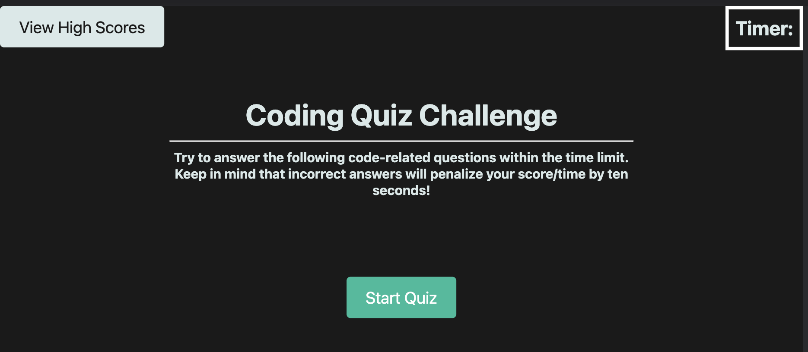
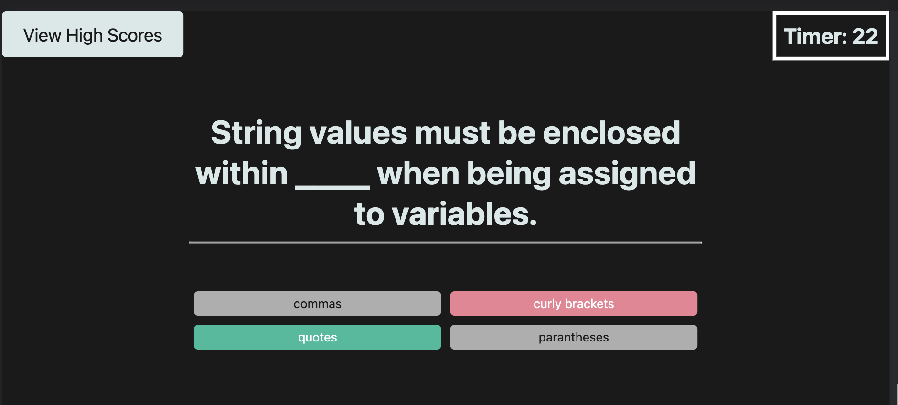
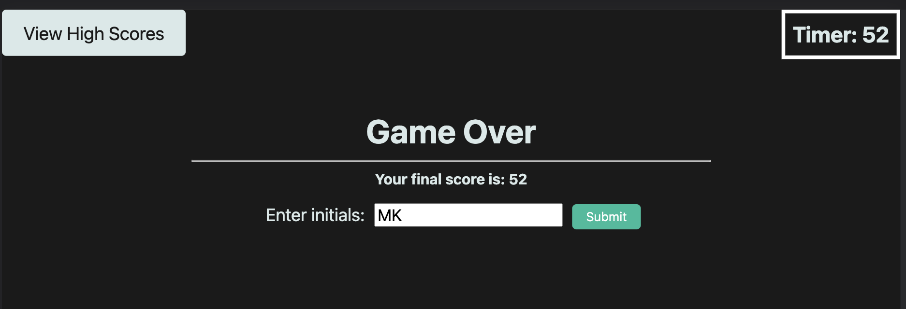
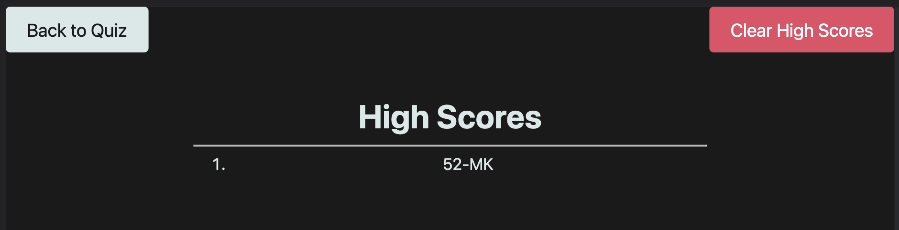

# Code Quiz

## Description

- Create a Coding quiz that tests users on their knowledge of coding knowledge and core concepts.
- Timer implmented where incorrect answers will deduct time. 
- High Scores feature with leaderboard of users with best time. 

## Table of Contents (Optional)

- [Usage](#usage)
- [Credits](#credits)

## Usage
Below is a screenshot of the initial home page for the coding quiz application:

Clicking 'Start Quiz' will start the timer and display questions. Choosing the wrong answer will display the correct answer in green and the selected wrong answer in red. Choosing a wrong answer will also deduct 10 seconds from the timer.

If the timer hits 0 or you have answered all the questions, the quiz is over and you are presented with your final score and an opportunity to save your initials and score to the leaderboard. The leaderboard is sorted from highest score to lowest.

You can view the high scores at any time by clicking the 'View High Scores' from the home screen:

## Credits

- https://www.tutorialrepublic.com/jquery-tutorial/jquery-add-and-remove-css-classes.php
- https://stackoverflow.com/questions/21299399/jquery-get-the-title-of-a-button
- https://stackoverflow.com/questions/22146904/jquery-onclick-add-margin-left
- https://stackoverflow.com/questions/2326209/how-to-override-a-class-using-jquery
- https://stackoverflow.com/questions/203198/event-binding-on-dynamically-created-elements
- https://stackoverflow.com/questions/12887702/javascript-display-new-page-when-submit-html-form
- https://stackoverflow.com/questions/3357553/how-do-i-store-an-array-in-localstorage
- https://www.geeksforgeeks.org/how-to-store-an-array-in-localstorage/#
- https://stackoverflow.com/questions/3262605/how-to-check-whether-a-storage-item-is-set
- https://stackoverflow.com/questions/35948669/how-to-check-if-a-value-exists-in-an-object-using-javascript
